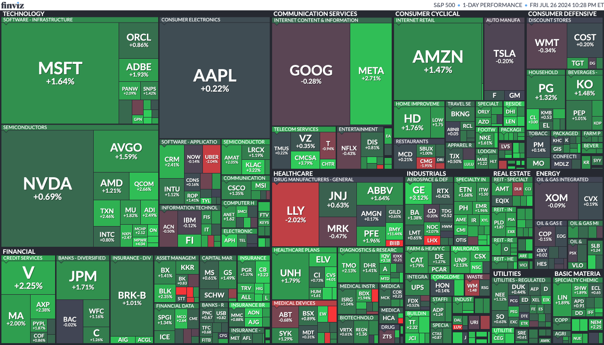
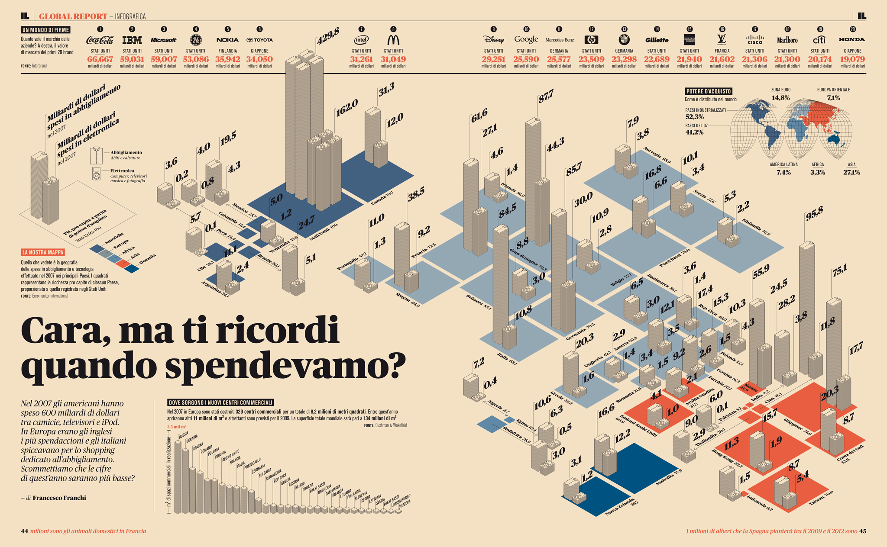

# Data Visualization

## Assignment 2: Good and Bad Data Visualization

### Requirements:

- Data visualizations are important tools for communication and convincing; we need to be able to evaluate the ways that data are presented in visual form to be critical consumers of information 
- To test your evaluation skills, locate two public data visualizations online, one good and one bad  
    - You can find data visualizations at https://public.tableau.com/app/discover or https://datavizproject.com/, or anywhere else you like! 
- For each visualization (good and bad):  
    - Explain (with reference to material covered up to date, along with readings and other scholarly sources, as needed) why you classified that visualization the way you did.
      
      Good example:<br>
      <br>
      Link: https://finviz.com/map.ashx?t=sec

      The provided treemap is a good example for data visualization best practices due to following reasons:
      - It effectively organizes data hierarchically by sector, making it easy to see which stocks belong to which sectors;
      - The size of each rectangle represents the market capitalization of each stock, providing a visual cue about the relative size of each company within its sector;
      - The use of color effectively communicates performance: green for positive returns, red for negative returns, and varying shades indicating the magnitude of the change. This allows for quick visual assessment of the overall market performance;
      - The treemap maximizes the use of available space, presenting a large amount of data without overwhelming the viewer. This is particularly useful for summarizing the performance of numerous stocks in a compact form;
      - Each sector is clearly labeled, and the largest companies within each sector are easily identifiable by their larger rectangles and prominent labels;
      - The contrasting shades of green and red ensure that even minor performance differences are visible, enhancing the chart's utility for detailed analysis.

      The treemap effectively combines a large volume of data into an accessible and informative visual format, making it easy to compare and contrast the performance of individual stocks and sectors. The clear hierarchical structure, proportional representation, and color coding make it a strong example of good data visualization practices.
      
      <br>

      Bad example:<br>
      <br>
      Link: https://www.flickr.com/photos/ffranchi/3048934446/in/photostream/
      
      There are several aspects to support the statement:
      - The chart is overly complex: The 3D elements, numerous labels, and overlapping bars make the chart visually cluttered and hard to interpret quickly;
      - Color choices: The colors are not distinct enough to easily differentiate between categories, especially for those with color vision deficiencies;
      - Labeling and readability: The abundance of labels and small text sizes can be difficult to read and comprehend.<br>

      While the chart is rich in information and visually appealing, its complexity and design choices hinder its effectiveness in conveying data clearly and efficiently. Simplifying the layout, improving color contrast, and making labels more readable could significantly enhance its utility.


    - How could this data visualization have been improved?  
      ```
      For the bad example, which explores how much money was spent by people in each region/country on clothing and technology in 2007, I'd utilize bubble charts to illustrate the relationship between several variables by varying the size of the bubbles. This adds another dimension of data without making the chart too complex. I'd use distinct colors to represent different regions/countries and add labels or tooltips for bubbles to provide additional information (total amount spent, type of spending, etc.). This helps in identifying specific data points easily.
      
      ```
- Word count should not exceed (as a maximum) 500 words for each visualization (i.e. 
300 words for your good example and 500 for your bad example)

### Why am I doing this assignment?:

- This assignment ensures active participation in the course, and assesses the learning outcomes
* Apply general design principles to create accessible and equitable data visualizations
* Use data visualization to tell a story

### Rubric:

| Component               | Scoring   | Requirement                                                 |
|-------------------------|-----------|-------------------------------------------------------------|
| Data viz classification and justification | Complete/Incomplete | - Data viz are clearly classified as good or bad<br />- At least three reasons for each classification are provided<br />- Reasoning is supported by course content or scholarly sources |
| Suggested improvements  | Complete/Incomplete | - At least two suggestions for improvement<br />- Suggestions are supported by course content or scholarly sources |

## Submission Information

🚨 **Please review our [Assignment Submission Guide](https://github.com/UofT-DSI/onboarding/blob/main/onboarding_documents/submissions.md)** 🚨 for detailed instructions on how to format, branch, and submit your work. Following these guidelines is crucial for your submissions to be evaluated correctly.

### Submission Parameters:
* Submission Due Date: `HH:MM AM/PM - DD/MM/YYYY`
* The branch name for your repo should be: `assignment-2`
* What to submit for this assignment:
    * This markdown file (assignment_2.md) should be populated and should be the only change in your pull request.
* What the pull request link should look like for this assignment: `https://github.com/<your_github_username>/visualization/pull/<pr_id>`
    * Open a private window in your browser. Copy and paste the link to your pull request into the address bar. Make sure you can see your pull request properly. This helps the technical facilitator and learning support staff review your submission easily.

Checklist:
- [X] Create a branch called `assignment-2`.
- [X] Ensure that the repository is public.
- [X] Review [the PR description guidelines](https://github.com/UofT-DSI/onboarding/blob/main/onboarding_documents/submissions.md#guidelines-for-pull-request-descriptions) and adhere to them.
- [X] Verify that the link is accessible in a private browser window.

If you encounter any difficulties or have questions, please don't hesitate to reach out to our team via our Slack at `#cohort-3-help`. Our Technical Facilitators and Learning Support staff are here to help you navigate any challenges.
