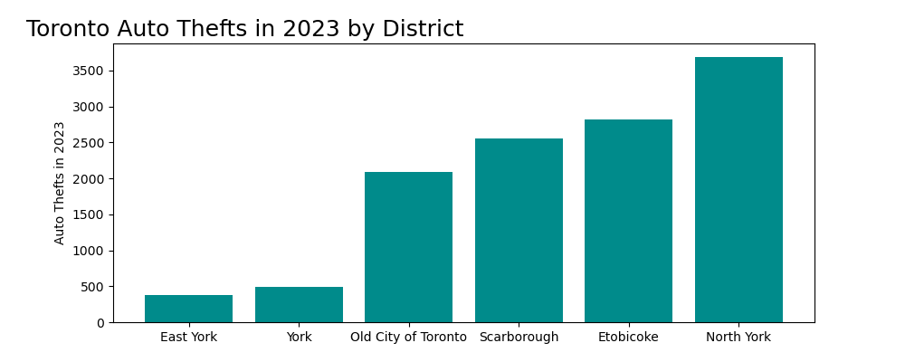
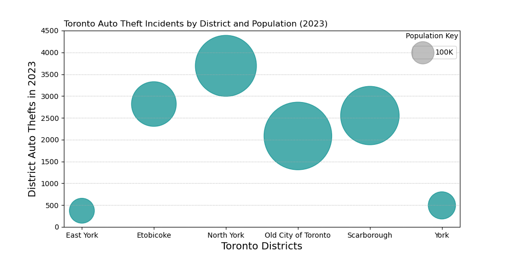

# Data Visualization

## Assignment 4: Final Project

### Requirements:
- We will finish this class by giving you the chance to use what you have learned in a practical context, by creating data visualizations from raw data. 
- Choose a dataset of interest from the [City of Toronto’s Open Data Portal](https://www.toronto.ca/city-government/data-research-maps/open-data/) or [Ontario’s Open Data Catalogue](https://data.ontario.ca/). 
- Using Python and one other data visualization software (Excel or free alternative, Tableau Public, any other tool you prefer), create two distinct visualizations from your dataset of choice.  

Visualization 1 (Bar Chart): 
 
Data Source: https://open.toronto.ca/dataset/neighbourhood-crime-rates/

Visualization 2 (Bubble Chart): 
 
Data Source: https://open.toronto.ca/dataset/neighbourhood-crime-rates/

- For each visualization, describe and justify: 
    > What software did you use to create your data visualization? 
    *A: Google Sheets for data preprocessing and Python for visualization (Matplotlib/Seaborn)*

    > Who is your intended audience? 
    *A: The primary audience for this visualization is individuals and organizations concerned with urban safety and crime patterns in Toronto. This includes residents, law enforcement agencies, city planners, and researchers interested in urban studies and criminology.*

    > What information or message are you trying to convey with your visualization? 
    *A: The visualization aims to convey the spatial distribution of auto theft incidents across different Toronto districts relative to their population size. By using bubble size to represent the number of auto thefts, the chart highlights areas with higher or lower rates of auto theft compared to their population.*
    
    > What design principles (substantive, perceptual, aesthetic) did you consider when making your visualization? How did you apply these principles? With what elements of your plots? 
    *A: Both visualizations accurately reflect the data on auto theft incidents and population for each district. 
    - Bar chart: Bar heights effectively represent the relative magnitude of auto thefts. 
    - Bubble chart: Bubble size and y-axis position effectively convey the number of auto thefts and population for each district. The y-axis provides numerical values for precise comparison. 
    Both visualizations have a clear and uncluttered layout with contrasting colors for enhanced readability and visual appeal.*
    
    > How did you ensure that your data visualizations are reproducible? If the tool you used to make your data visualization is not reproducible, how will this impact your data visualization? 
    *A: The provided code demonstrates the libraries and steps used to create the visualizations. This transparency significantly improves reproducibility. Anyone with access to the data and these libraries can recreate the visualizations.*
    
    > How did you ensure that your data visualization is accessible? 
    - Clear and concise labeling: Both charts feature clear and concise labels for axes, titles, and data points, ensuring easy interpretation.
    - Effective use of color and design: The color palette and overall design enhance readability and visual appeal without compromising accessibility.
    - Appropriate chart types and layout: The choice of bar and bubble charts, combined with effective use of white space, contributes to clear and understandable visualizations.
    
    > Who are the individuals and communities who might be impacted by your visualization? 
    *A: These visualizations can impact various individuals and communities: 
    - Residents: May experience increased awareness of auto theft rates in their districts. 
    - Law enforcement: Can utilize this data to allocate resources and target crime prevention efforts. 
    - City planners and policymakers: Can consider this information during urban planning strategies and resource allocation.*

    > How did you choose which features of your chosen dataset to include or exclude from your visualization? 
    *A: The visualizations focus on the number of auto thefts in each district and the district population to help citizens determine the best location when considering relocation within Toronto’s districts.*
    
    > What ‘underwater labour’ contributed to your final data visualization product? 
    *A: It involed collecting, aggregating, and preprocessing the data on auto theft incidents for each Toronto district, choosing the appropriate visualization types and designing the layouts, and formatting the chart elements (labels, titles, legends) for clarity and visual appeal.*

- This assignment is intentionally open-ended - you are free to create static or dynamic data visualizations, maps, or whatever form of data visualization you think best communicates your information to your audience of choice! 
- Total word count should not exceed **(as a maximum) 1000 words** 
 
### Why am I doing this assignment?:  
- This ongoing assignment ensures active participation in the course, and assesses the learning outcomes: 
* Create and customize data visualizations from start to finish in Python
* Apply general design principles to create accessible and equitable data visualizations
* Use data visualization to tell a story  
- This would be a great project to include in your GitHub Portfolio – put in the effort to make it something worthy of showing prospective employers!

### Rubric:

| Component         | Scoring  | Requirement                                                                 |
|-------------------|----------|-----------------------------------------------------------------------------|
| Data Visualizations | Complete/Incomplete | - Data visualizations are distinct from each other - Data visualizations are clearly identified - Different sources/rationales (text with two images of data, if visualizations are labeled) - High-quality visuals (high resolution and clear data) - Data visualizations follow best practices of accessibility |
| Written Explanations | Complete/Incomplete | - All questions from assignment description are answered for each visualization - Explanations are supported by course content or scholarly sources, where needed |
| Code              | Complete/Incomplete | - All code is included as an appendix with your final submissions - Code is clearly commented and reproducible |

## Submission Information

🚨 **Please review our [Assignment Submission Guide](https://github.com/UofT-DSI/onboarding/blob/main/onboarding_documents/submissions.md)** 🚨 for detailed instructions on how to format, branch, and submit your work. Following these guidelines is crucial for your submissions to be evaluated correctly.

### Submission Parameters:
* Submission Due Date: `HH:MM AM/PM - DD/MM/YYYY`
* The branch name for your repo should be: `assignment-4`
* What to submit for this assignment:
    * A folder/directory containing:
        * This file (assignment_4.md)
        * Two data visualizations 
        * Two markdown files for each both visualizations with their written descriptions.
        * Link to your dataset of choice.
        * Complete and commented code as an appendix (for your visualization made with Python, and for the other, if relevant) 
* What the pull request link should look like for this assignment: `https://github.com/<your_github_username>/visualization/pull/<pr_id>`
    * Open a private window in your browser. Copy and paste the link to your pull request into the address bar. Make sure you can see your pull request properly. This helps the technical facilitator and learning support staff review your submission easily.

Checklist:
- [X] Create a branch called `assignment-4`.
- [X] Ensure that the repository is public.
- [X] Review [the PR description guidelines](https://github.com/UofT-DSI/onboarding/blob/main/onboarding_documents/submissions.md#guidelines-for-pull-request-descriptions) and adhere to them.
- [X] Verify that the link is accessible in a private browser window.

If you encounter any difficulties or have questions, please don't hesitate to reach out to our team via our Slack at `#cohort-3-help`. Our Technical Facilitators and Learning Support staff are here to help you navigate any challenges.
